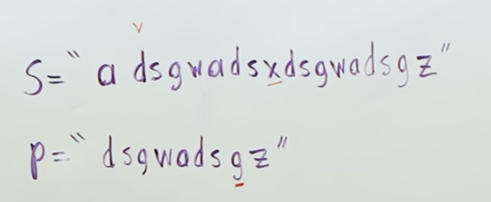

# Knuth–Morris–Pratt Algorithm

The Knuth–Morris–Pratt string searching algorithm (or
KMP algorithm) searches for occurrences of a "word" `W`
within a main "text string" `T` by employing the
observation that when a mismatch occurs, the word itself
embodies sufficient information to determine where the
next match could begin, thus bypassing re-examination
of previously matched characters.

Example:
S = "aaaaab"
P = "aaab"
ans = aaab

## Complexity

- **Time:** `O(|W| + |T|)` (much faster comparing to trivial `O(|W| * |T|)`)
- **Space:** `O(|W|)`

## Youtube

- [KMP Pattern Youtube](https://www.youtube.com/watch?v=BXCEFAzhxGY)

## References

- [Wikipedia](https://en.wikipedia.org/wiki/Knuth%E2%80%93Morris%E2%80%93Pratt_algorithm)
- [YouTube](https://www.youtube.com/watch?v=GTJr8OvyEVQ&list=PLLXdhg_r2hKA7DPDsunoDZ-Z769jWn4R8)
